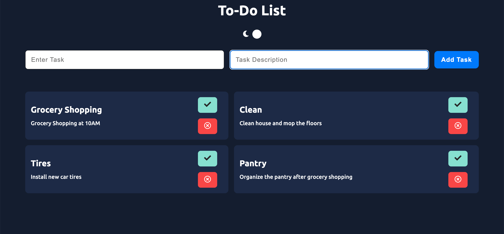

# To-do List

# Overview
Welcome! This is my to-do list app that I created using React as the front-end framework and SCSS/SASS a CSS-preprocesser for styling the application. I created this to practice CRUD development and to gain insight about it, so that I can create my next application which is an expense tracker and budgeting application. I believe creating the TODO app first would help introduce me to important concepts in order to build the finance app I wanted. 

# Key features
- The user is able to toggle between dark and light mode and the page adjusts accordingly 
- The user is able to enter their task and its description, which will be displayed at the bottom of the screen.
- The user is able to check off their task and delete it

# Resources and Tech Stack Used
- Jack Herrington on Youtube for React Resources [https://www.youtube.com/channel/UC6vRUjYqDuoUsYsku86Lrsw]
- React JS [https://reactjs.org/]
- React Switch [https://www.npmjs.com/package/react-switch]
- UX Design Insight [https://uxdesign.cc/the-light-and-the-dark-side-creating-a-ui-colour-system-in-3-steps-41818c5bdb60]
- SASS (CSS-preprocesser) - [https://sass-lang.com/documentation/]

# Concepts Learned
- Working more with ReactJS I was able to learn more about useContext() and avoid prop drilling. I had more practice with useState() as well, which is important when it comes to dynamic interactions
- CRUD Create Read Update Delete. I was able to work with the localStorage in this To do app. I wanted to learn more database concepts and CRUD is a good starting point for that